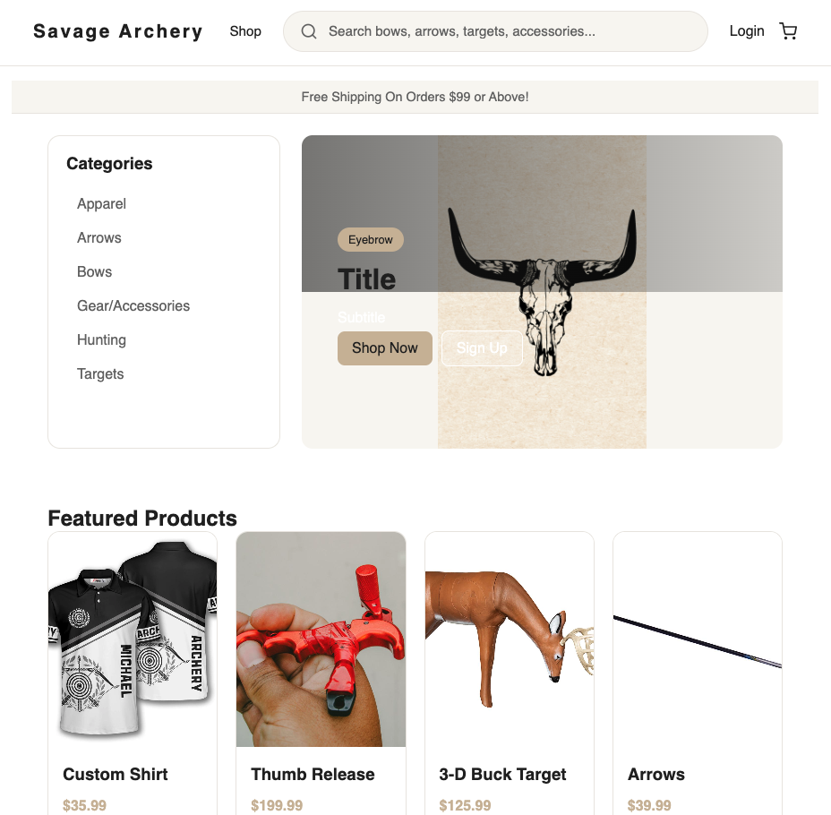

# 🏹 Archery Commerce Platform

A full-stack ecommerce web application built for managing and purchasing archery products online. The platform includes user authentication, product management, shopping cart functionality, and order processing through a modern React frontend and Django REST backend.

Live Site: Coming soon!

## 🚀 Live Demo

Coming Soon

---

## 📸 Preview



---

## 🛠 Tech Stack

### Frontend
- React
- JavaScript
- Axios
- CSS3
- Responsive Design

### Backend
- Django
- Django REST Framework
- Python
- JWT Authentication
- REST APIs

### Database
- PostgreSQL

---

## ✨ Features

- User authentication & login system
- JWT-based secure authentication
- Product catalog with dynamic API data
- Shopping cart functionality
- Order management system
- Admin product management
- Responsive mobile-friendly UI
- RESTful backend architecture

---

## 📚 What I Learned

This project helped strengthen my understanding of:

- Full-stack application architecture
- React state management
- API integration with Axios
- Building REST APIs using Django REST Framework
- Authentication workflows using JWT
- Database modeling and backend organization

---

## ⚙️ Installation

### Clone the repository

```bash
git clone <repo-url>
```

### Frontend Setup

```bash
cd frontend
npm install
npm run dev
```

### Backend Setup

```bash
cd backend
source venv/bin/activate
pip install -r requirements.txt
python manage.py runserver
```

---

## 📌 Future Improvements

- Stripe payment integration
- Product search and filtering
- User profile dashboard
- Wishlist system
- Deployment to production